1. TOC
{:toc}

# Communication PCB

The communication PCB or "comm board" measures 40×40mm² and has a 15 pin connector on the bottom and a matching socket on the top edge. In addition, there are four 4×4 female sockets ([v0.3](#comm-v0p3)) or two 3×6 male pins ([v0.1](#comm-v0p1)) on the top side of the PCB. This board extracts data packets for the current panel from the SPI stream and sends them via I²C to the driver board. The connectors always need to be connected to either a adjacent comm board or an arena.

{:standalone .ifr}

To identify packets for the current panel, each comm uses four of its connectors as "chip select" lines. This means, while the first chip select line is active, the comm board splits and forwards the received data to the driver board. Independently, the data is always forwarded to the next panel. In addition, the comm board drops the first chip select line from the input and makes the second input chip select line the first output chip select, the 3rd becomes second, and the fourth the 3rd output. This way, up to four stacked panel PCB can be addressed individually.

While the chip select line is active for the current panel, a micro controller unit (MCU) splits the incoming signal into smaller chunks. The driver boards are usually divided into quadrants, and the comm board forwards the matching data packages to the quadrants via I²C bus. The change of protocol has historic reasons. Most recent [comm boards v0.3](#comm-v0p3) use four connectors for the driver board, earlier versions had only two.

## Panel Comm PCB v0.3 {#comm-v0p3}

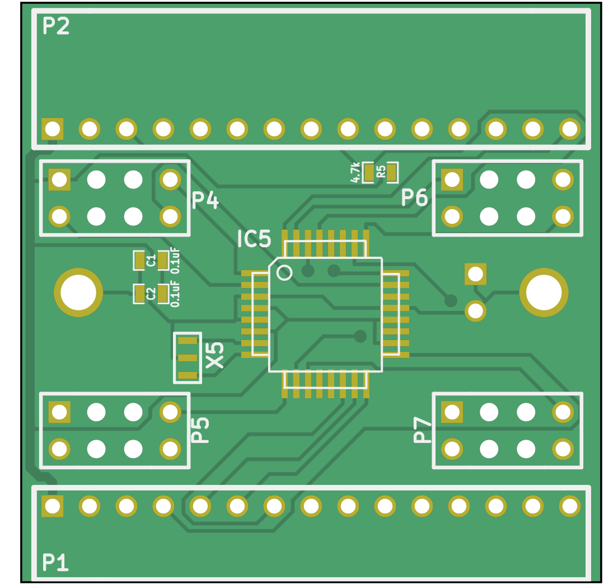{:.ifr .pop}

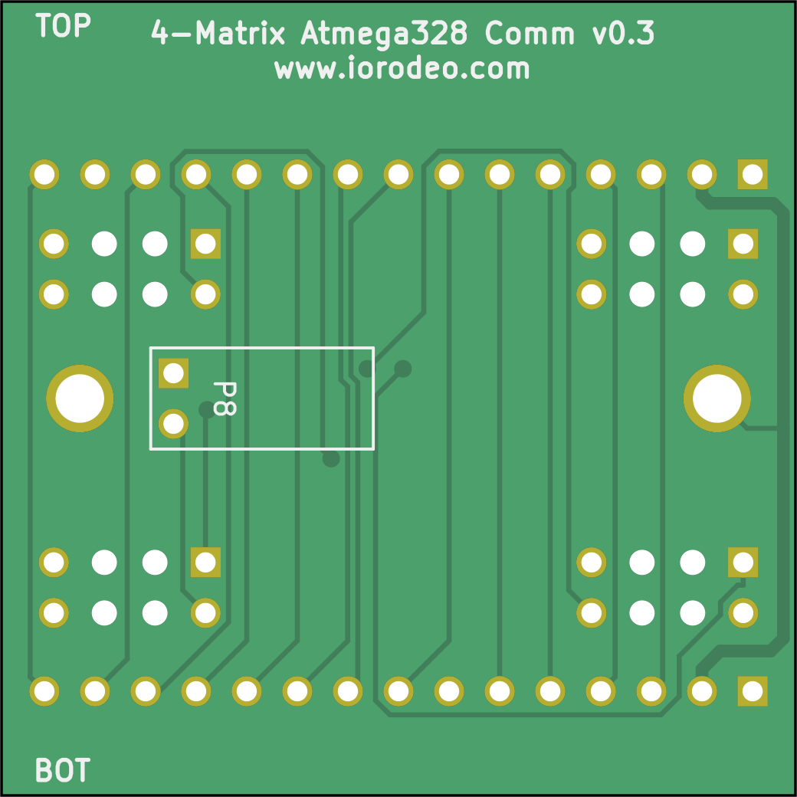{:standalone .ifr .clear data-img-class="pop"}

The communication board is a 40×40mm² PCB with two layers, most recently available as version v0.3 available in `comm_v0p3` (see [schematic](assets/comm_v0p3_schematic.pdf)). The connectors are designed as through-hole, other components are SMD.

### Function

The comm board v0.3 receive signals (P1), send them on (P2). Based on the chip select line it identifies the signals relevant for the current panel. This processing is done with the help of a 20MHz ATmega328P-AUR (IC5). The relevant signals are passed to one of the four driver board quadrants (P4…P7).

### Design

The files are inside the `comm_v0p3` folder and find the production files inside the `comm_v0p3/production_v0/` directory.

The design files are shared under a creative commons license as [KiCad](https://kicad-pcb.org/) EDA source files. They were initially developed by [IORodeo](https://iorodeo.com). If you open the schematics in a current version of KiCad you might be asked to remap the symbols when you first open the files.

### Production

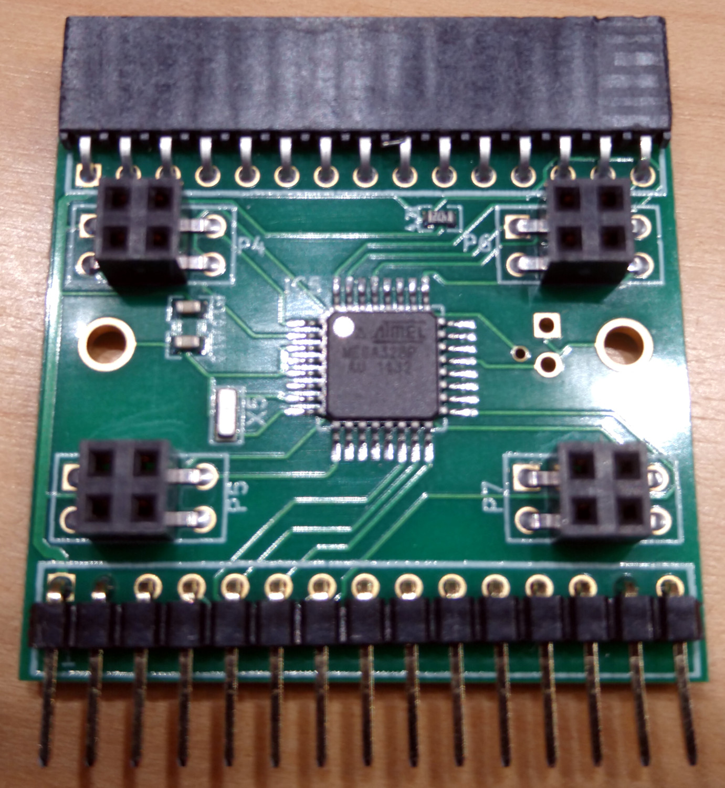{:standalone .ifr .clear data-img-class="pop"}

The Comm board v0.3 is a two layer PCB with 1oz copper that has no special requirements on the production process. We typically order them on the default FR-4. The board has through-hole components such as the connectors, but the majority of components are SMD with the smallest package of 0603 (imperial) or 1608 (metric).

For an order volume of 150 pieces we would expect prices around $16 for the assembled board. This might be around $1.50 for the board, $8 for the components, $6 for the assembly, and $.50 for shipping. Recently we have had good experiences with [Bittele](https://www.7pcb.com/). If you decide to order at Bittele, you can provide quotation Q70762A1 and order number 39493C2 as references for successful builds.

## Panel Window PCB {#window}

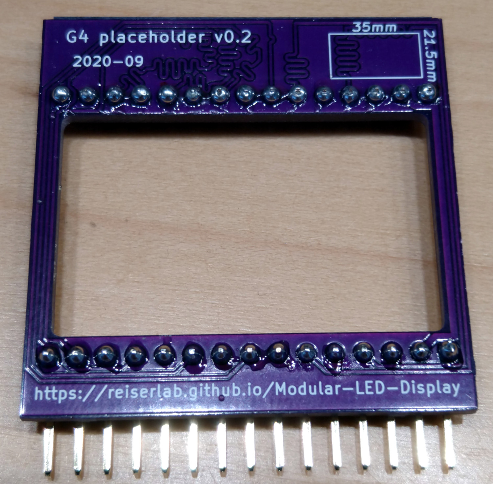{:standalone .ifr .clear data-img-class="pop"}

This PCB acts as a drop-in replacement for panels within a column. It has a cut out of 35×21mm² which you can use to point a camera or other device through that column. In most cases this is not needed, yet it is the most simple and cheap PCB you can get produced from the G4 system. So if you haven't had any experience with the process of ordering PCBs, you might want to start here. Before version v0.3 this was called "placeholder".

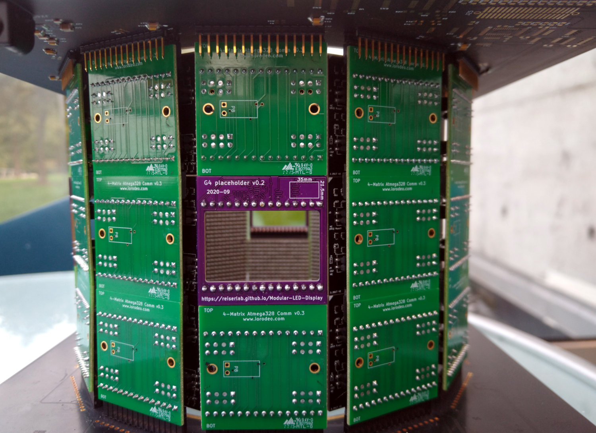{:standalone .ifr .clear data-img-class="pop"}

If you want to skip a panel within a column, you will need to connect the chip select lines accordingly. The image on the right shows which input and output connectors your want to connect. Note, that the signal is travelling from the bottom to the top. This has often been done with wires.

Alternatively you can use the window PCB to achieve the same. The PCB has the same outer dimensions and same connectors as the Comm PCB and provides the wiring described above between input and output.

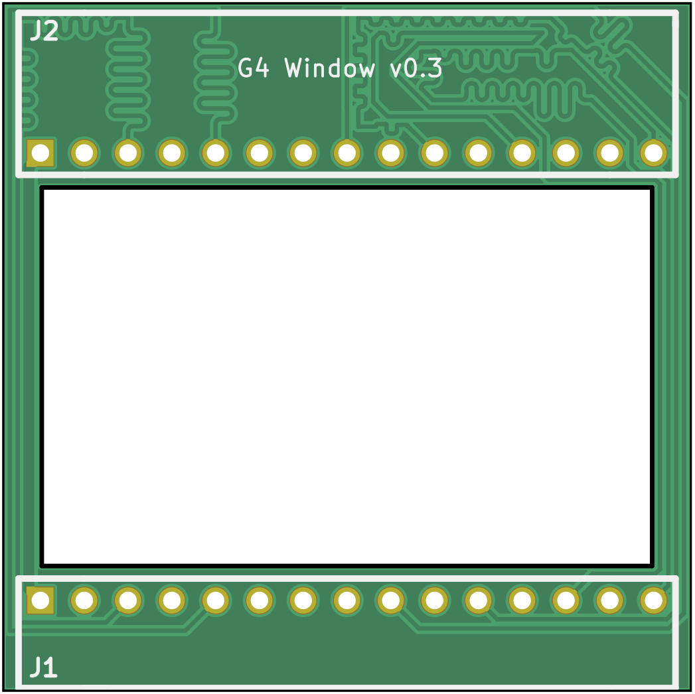{:.ifr .pop .clear}

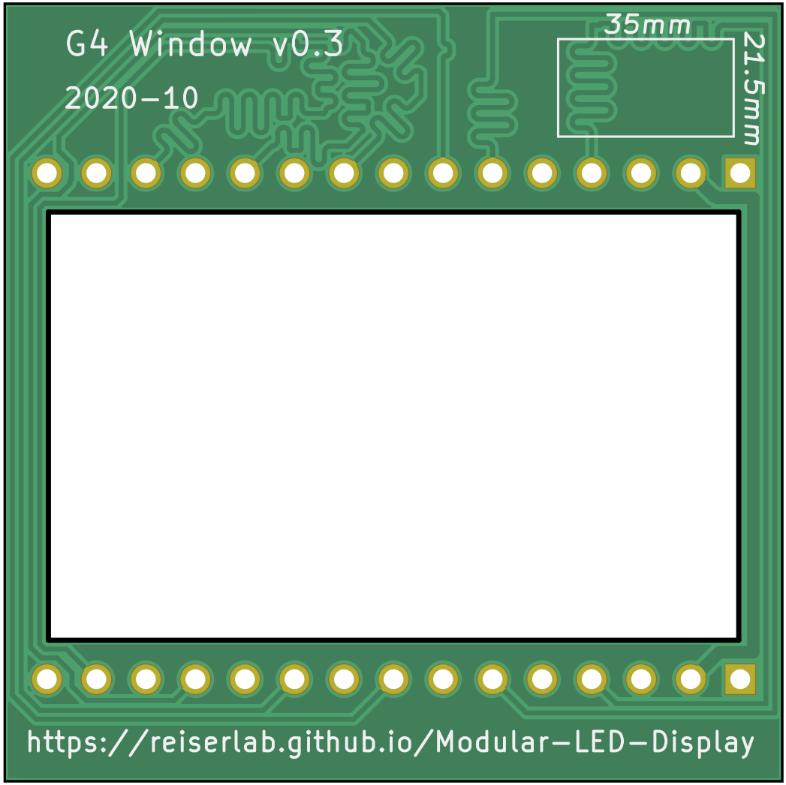{:standalone .ifr .clear data-img-class="pop"}

The KiCad design files for this simple 2-layer PCB are in the folder `comm_placeholder_v0`. The files ready for production are inside the `comm_placeholder_v0/production_v0` folder. Most recently `comm_placeholder_v0p3.zip` uses length matched traces. All you need to order this design is the zip file, which contains the relevant files from the directory, and most manufacturers will accept. So far we have ordered this exact design from [OSHPark](https://oshpark.com/) with a quick turn-around time of around 5 days and a total cost of $10 per board, including components. With enough lead time, higher quantities, and other manufacturers the price should be around $1 per unit. For example, in October 2020 an order of 30 window PCB at [JLCPCB](https://jlcpcb.com/) cost less than $20 including shipping and was delivered within 14 days.

The window might be a good start to familiarize yourself with file types, the organization of our repositories, and the whole production process, if you have never done that before. Otherwise please apologize the boring details in the text above.

# Connections

The bottom pins have the following meanings, seen from the direction of the driver:

| No | Name           | Description  |
| --:|:---------------|:-------------|
|  1 | `5VCC`         | (5V Power) |
|  2 | `GND`          | (Ground) |
|  3 | `RESET_MAIN`   | (Reset all panels) |
|  4 | `SCK`          | (Serial Clock) |
|  5 | `COPI`         | (Controller Out, Peripheral In) |
|  6 | `CIPO`         | (Controller In, Peripheral Out) |
|  7 | `CS1`          | (Chip Select 1) |
|  8 | `CS2`          | (Chip Select 2) |
|  9 | `CS3`          | (Chip Select 3) |
| 10 | `CS4`          | (Chip Select 4) |
| 11 | `CS5`          | (Chip Select 5) |
| 12 | `CS6`          | (Chip Select 6) |
| 13 | `CS7`          | (Chip Select 7) |
| 14 | `NC`           | (Not Connected) |
| 15 | `EXT_INTO`     |  |

Here, `SCK`, `COPI`, `CIPO`, and `CSx` are used for the SPI communication. `RESET_MAIN` sends a reset signal to all MCUs.

# Historic designs

These designs are kept for historic reasons and to debug existing systems. If you have one of them, you probably know what to do and just need the files. If you are building a new system, don't use them.

## Panel Comm PCB v0.2 {#comm-v0p2}

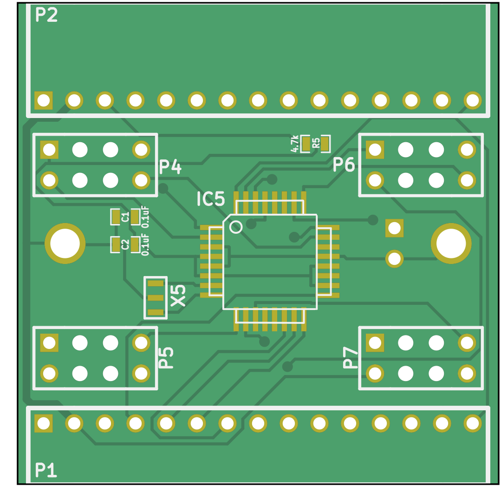{:.ifr .pop}

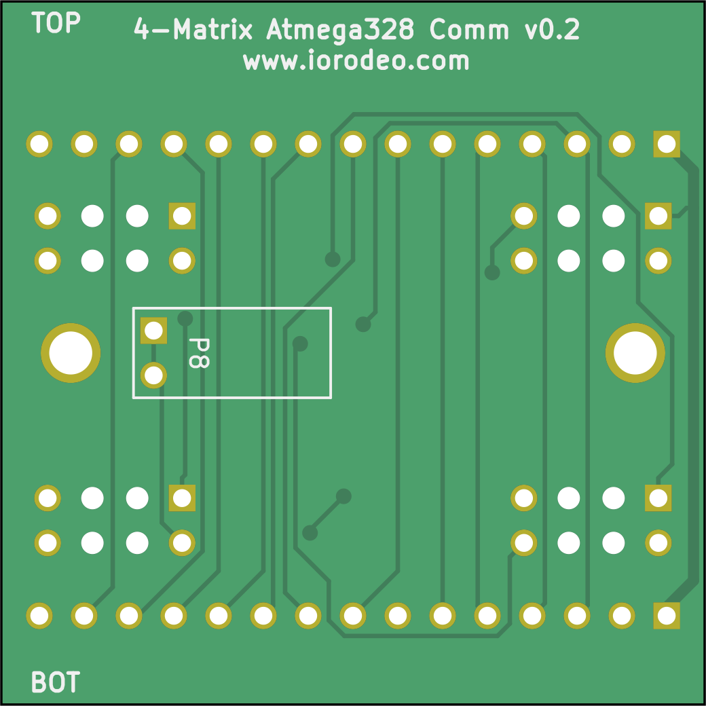{:standalone .ifr .clear data-img-class="pop"}

In theory, the v0.2 should have a 2×3 pin connector that was used for a brief time in certain drivers. The actual comm board with the 2×3 connector seems to be lost, so at this time we are not sure what version 0.2 is. If you wanna try and have a look at the [schematic](assets/comm_v0p2_schematic.pdf), feel free to use the project files in `comm_v0p2`.

Everything else regarding design and production is very similar to the [Comm board v0.3](#comm-v0p3). There is no reason to build a comm board v0.2, except maybe replacing a broken one. Even then you might consider an upgrade of your hardware instead, especially with the unknown background.

The original documentation for v0.2 contained hints that the communication was changed from I²C to SPI and that the board-to-board headers were improved.

## Panel Comm PCB v0.1
{:.clear #comm-v0p1}

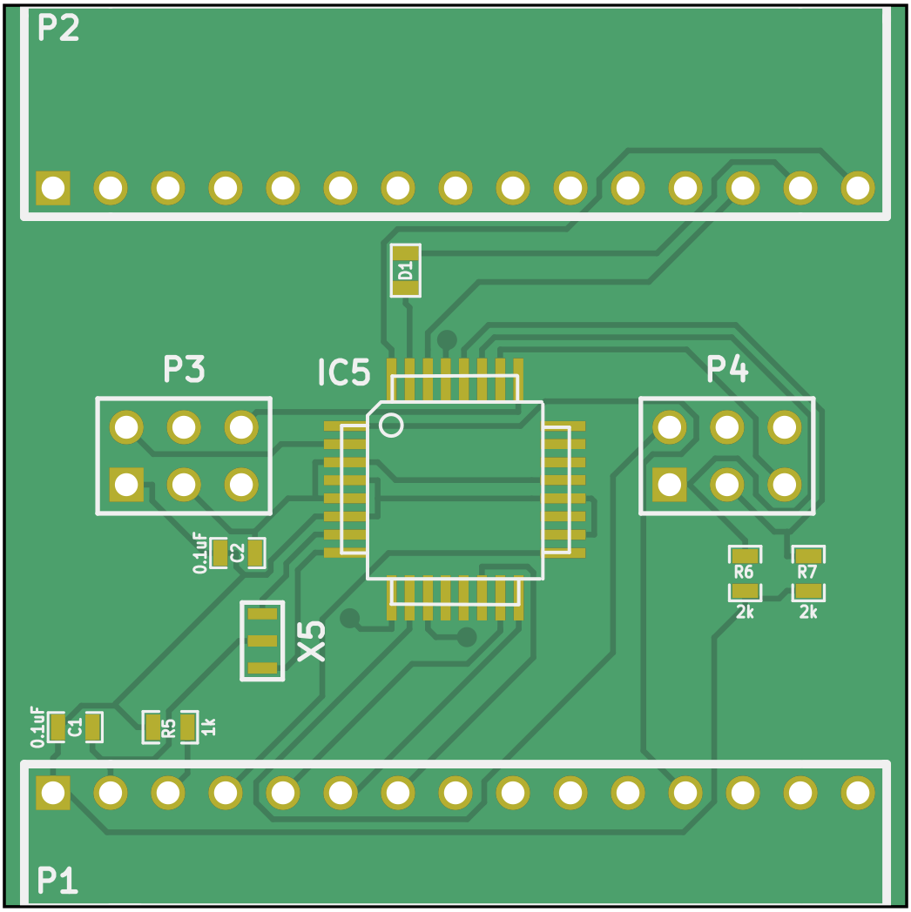{:.ifr .pop}

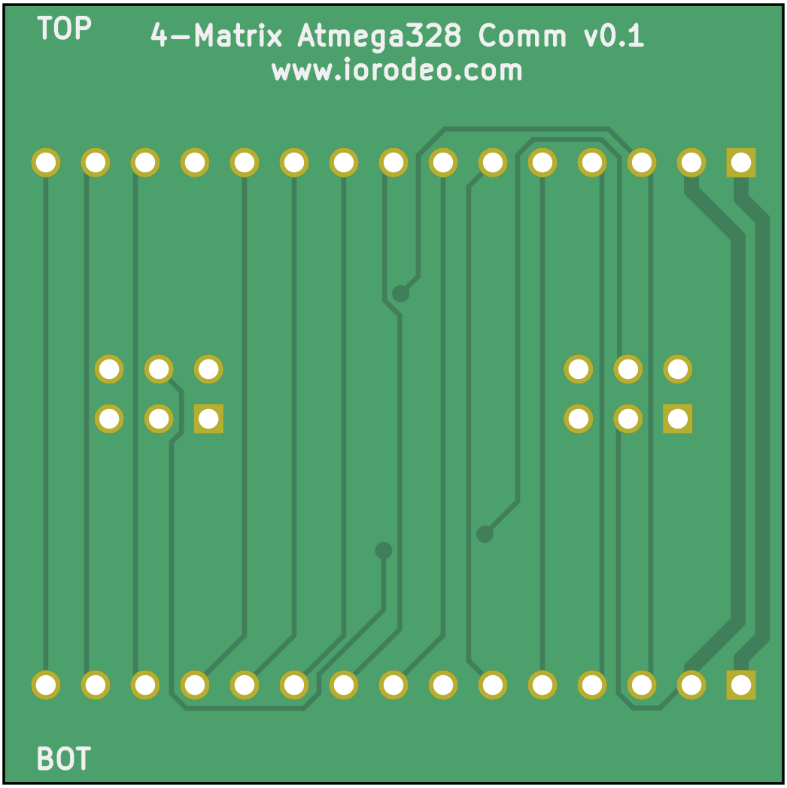{:standalone .ifr .clear data-img-class="pop"}

{:standalone .ifr .clear data-img-class="pop"}

`comm_v0p1` contains an earlier comm board project (see [schematic](assets/comm_v0p1_schematic.pdf)). This uses a different communication protocol and is not compatible with drivers-v0.2 and up. The files are there, should you need to repair your existing system with [driver-v0.1]({{site.baseurl}}/Generation%204/Panel/docs/driver.html#driver-v0p1).
